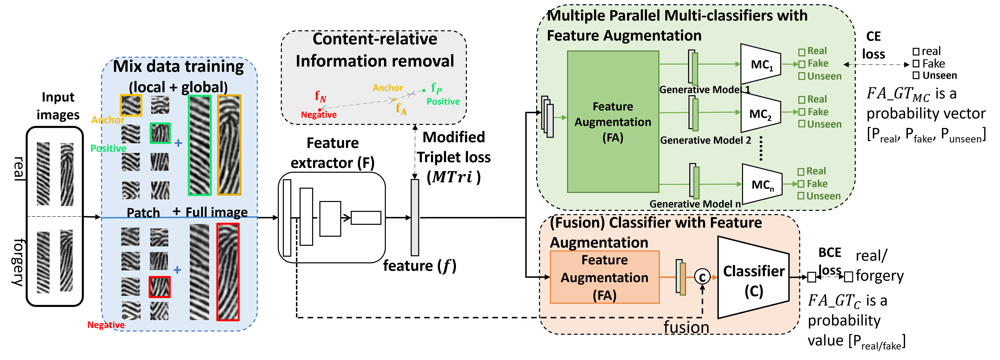

# IMG ResNet Detector v4 (Open Source Release)

This repository contains the open-source release of the fingerprint real/fake detection project from `IMG_ResNet_detector_v4`.

## Paper Overview

This project is based on the paper **"Towards Trustworthy Biometrics: Generalized Detection of Diffusion-Generated Fingerprint Forgeries in Partial Scenarios"**.
The main goal is to build a robust detector that can generalize across multiple diffusion/generative fingerprint forgery sources while preserving strong performance under partial fingerprint conditions.

- Paper file: `fig/Towards_Trustworthy_Biometrics__Generalized_Detection_of_Diffusion_Generated_Fingerprint_Forgeries_in_Partial_Scenarios (1).pdf`

### Paper Figures



**Figure 1. Method Overview.**  
This figure summarizes the end-to-end pipeline of the proposed fingerprint forgery detection framework. It illustrates how real and diffusion-generated partial fingerprint samples are processed, how feature representations are learned, and how the final binary decision (real vs. fake) is produced. The key emphasis is cross-domain generalization across multiple synthesis methods.

%20(1).png)

**Figure 2. Fingerprint System Architecture.**  
This figure presents the internal architecture used in the paper, including backbone feature extraction, classification modules, and decision components. It highlights the interaction between representation learning and classifier heads, which is designed to improve robustness under partial-image and unseen-generator conditions.

## Features

- Training scripts for multiple settings (`train.py`, `train_mix.py`, `train_mix_v2.py`)
- Evaluation pipeline (`eval.py`, `validate.py`)
- Dataset loaders with augmentation and reflect-padding

## Project Structure

- `data/`: dataset classes and dataloader utilities
- `networks/`: backbone, classifiers, trainer modules
- `options/`: train/test argparse options
- `train*.py`, `eval.py`, `validate.py`: training/evaluation entry points

## Environment

Python 3.9+ is recommended.

```bash
pip install -r requirements.txt
```

## Downloads

- Dataset download link: `http://gofile.me/7p5O4/t49hepFzZ`
- Best model checkpoint link: `http://gofile.me/7p5O4/Rrnldjigs`

## Dataset Layout

By default, scripts use `--data_root ./data` and expect this structure:

```text
<data_root>/
  train/
    real/
    DDIM/
    guided/
    ...
  val/
    real/
    DDIM/
    guided/
    ...
  test/
    real/
    cycleGAN/
    conditional_cycleGAN/
    ProGAN/
    styleGAN/
    styleGAN2-ada/
    DDIM/
    inpaint_with_FK/
    guided/
    LDM/
    ControlNet++/
    StableDiffusion_1.5/
    StableDiffusion_3.5/
```

## Quick Start

### Train

```bash
bash train.sh
```

### Evaluate

1. Put a trained checkpoint under `./checkpoints/...`.
2. Update `--model_path` in `eval.sh` if needed.
3. Run:

```bash
bash eval.sh
```

### Export test set to NPZ (optional)

```bash
bash export_eval_test_npz.sh
```

## Notes for Open-Source Use

- Local machine absolute paths were replaced with portable relative defaults.
- Training artifacts (e.g. checkpoints/results/npz outputs) are intentionally excluded from versioned source.
- If you want to use your own class names for fake generation methods, update `eval_config.py` and script args.
